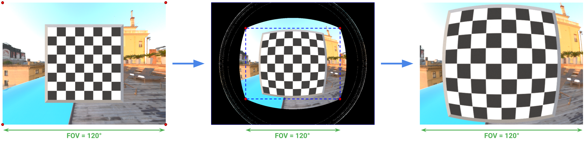
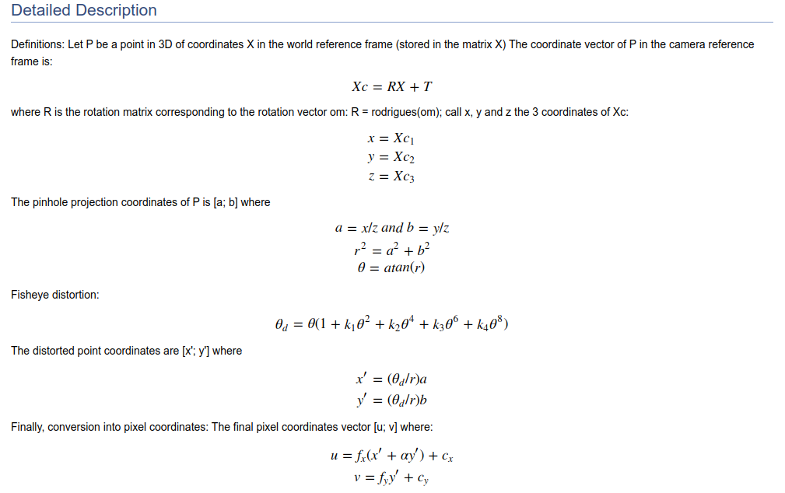

# fisheye-distortion



This script applies a fisheye distortion to rendered images. The output images can be cropped to a
rectangle and resized. The fisheye distortion is the same as detailed in OpenCV 4.4 [docs](https://docs.opencv.org/4.4.0/db/d58/group__calib3d__fisheye.html).
As mentioned in the docs, the distortion is characterized by 4 parameters, `[k1, k2, k3, k4]`, which are 
passed via the config file or command line arguments.

## Usage
The arguments for the script are passed via the config file. All the parameters in the
 config file can be overriden from the command line:
```bash
python apply_fisheye_distortion.py dir_input=images resize_output.h=1024 resize_output.w=768
```

Alternately, you can use the provided dockerfile. 
```bash
# Build the docker image
bash docker_build.sh

# Run the docker image
bash docker_run.sh

# Inside container
$ python apply_fisheye_distortion.py dir_input=/data
```

This will process all the images found in the container's `/data` directory. Modify the
`docker_run.sh` script to change which host directory is mounted to the container's `/data`.

### Config file
You can edit the config file, `config.yaml`, to customize the default parameters:
```yaml
dir_input: images/
dir_output: images/
input_rgb_ext: .rgb.png  # Distortion will be applied to all images matching this extension
input_json_ext: .json  # The camera intrinsics are loaded from this json file

distortion_parameters:
  # Ref: https://docs.opencv.org/4.4.0/db/d58/group__calib3d__fisheye.html
  # These are the distortion parameters of the fisheye camera model as defined in the fisheye module of OpenCV 4.4.0
  k1: 0.17149
  k2: -0.27191
  k3: 0.25787
  k4: -0.08054

resize_output:
  # The output of distortion script isn't exactly the aspect ratio of input due to rounding to integer pixel values.
  # We resize output to get exact aspect ratio back. Set to 0 to disable resize.
  h: 768
  w: 1024

dev:
  crop_output: True  # Whether to crop the output distorted image.

```

## Install
The dependencies can be installed via pip:
```bash
pip install requirements.txt
```

## Detailed Description
From OpenCV [docs](https://docs.opencv.org/4.4.0/db/d58/group__calib3d__fisheye.html),
here is the description of the fisheye camera model used to create the distortion. The
distortion co-efficients `[k1, k2, k3, k4]` are detailed below:

